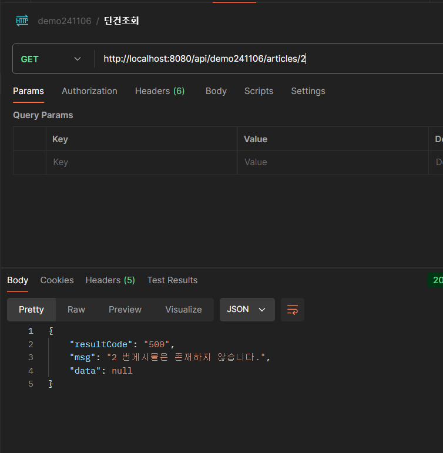
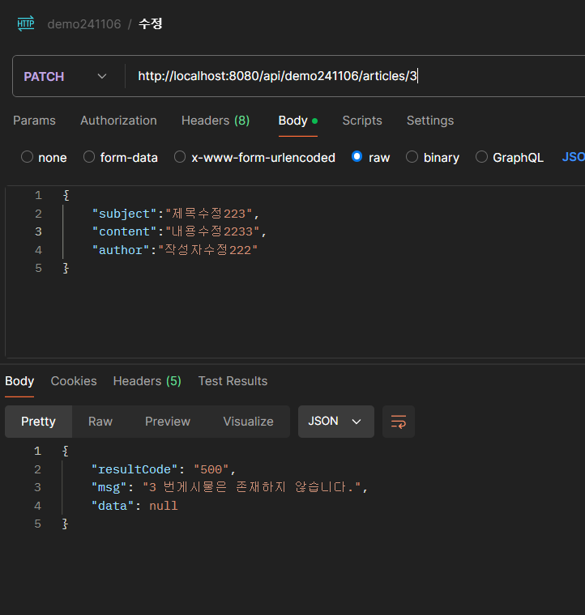
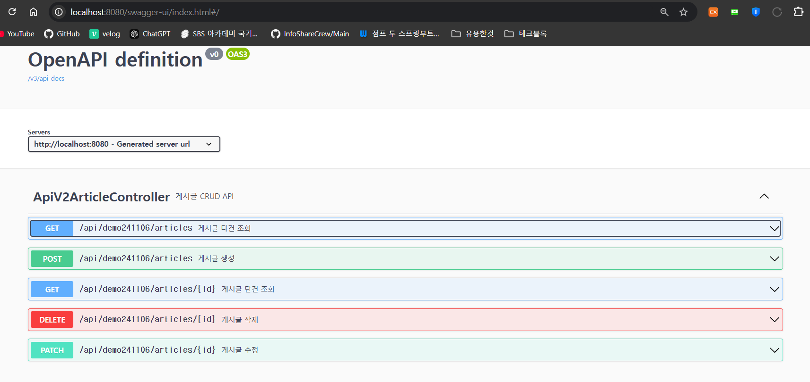

# demo241106
// 확인
# PostMan
##  GET /api/demo241106/articles
- [x]  모든 게시글의 목록을 조회합니다.
- 

##  GET /api/demo241106/articles/{id}
- [x]  특정 ID의 게시글을 조회합니다.
- 

##   POST /demo241106/v1/articles
- [x]  새로운 게시글을 등록합니다.
- 

##   PATCH /demo241106/v1/articles/{id}
- [x]  특정 ID의 게시글을 수정합니다.
- 

## DELETE /demo241106/v1/articles/{id}
- [x]  특정 ID의 게시글을 삭제합니다.
- 

### 에러메세지
- [x] 단건 조회 에러 메세지
- 

- [x] 수정 에러 메세지
- 

- [x] 삭제 에러 메세지
- 

# swagger
- [x] http://localhost:8080/swagger-ui/index.html
- 