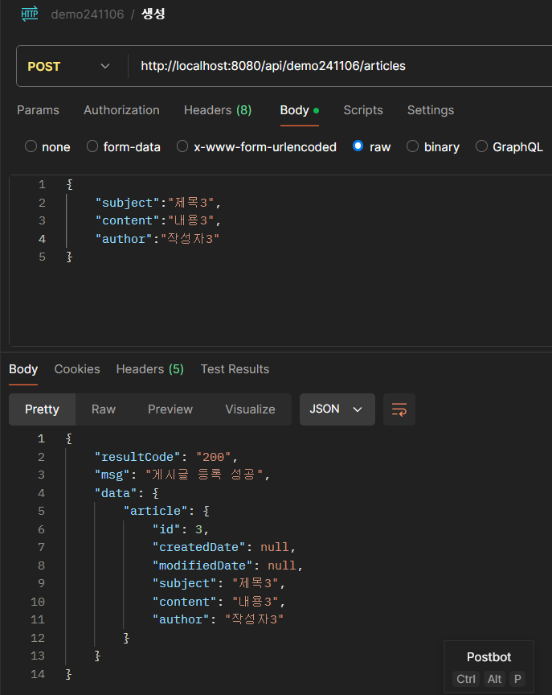
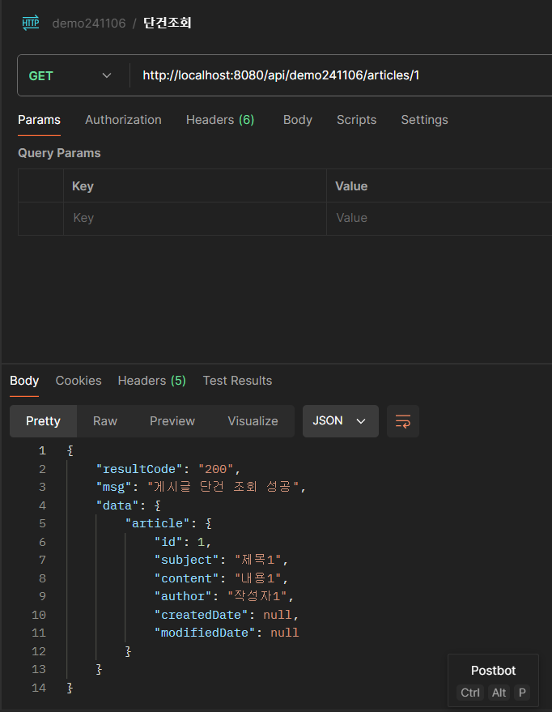
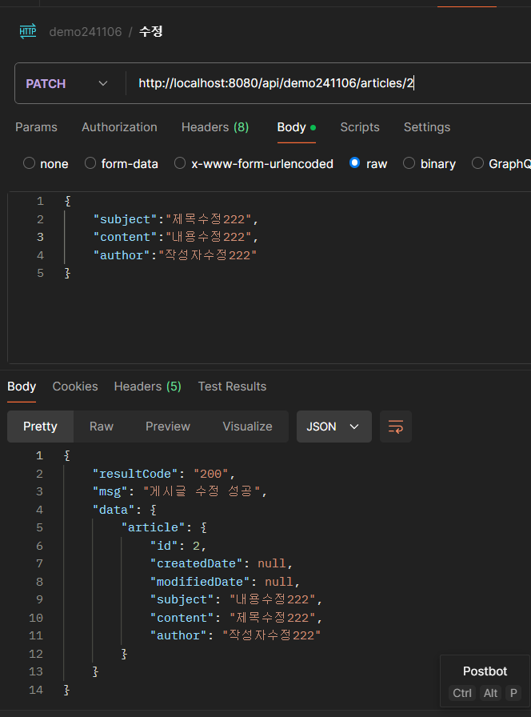
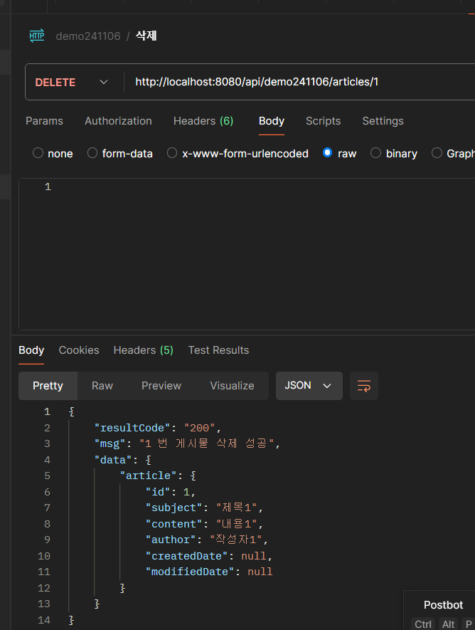
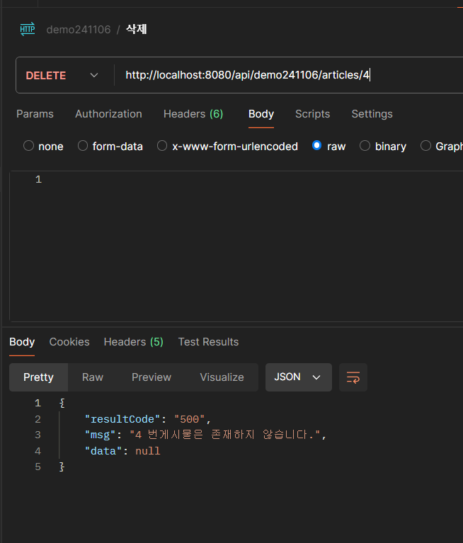

# demo241106

# PostMan
##  GET /api/demo241106/articles
- [ ]  모든 게시글의 목록을 조회합니다.
- 

##  GET /api/demo241106/articles/{id}
- [ ]  특정 ID의 게시글을 조회합니다.
- 

##   POST /demo241106/v1/articles
- [ ]  새로운 게시글을 등록합니다.
- 

##   PATCH /demo241106/v1/articles/{id}
- [ ]  특정 ID의 게시글을 수정합니다.
- 

## DELETE /demo241106/v1/articles/{id}
- [ ]  특정 ID의 게시글을 삭제합니다.
- 

### 오류
- 
